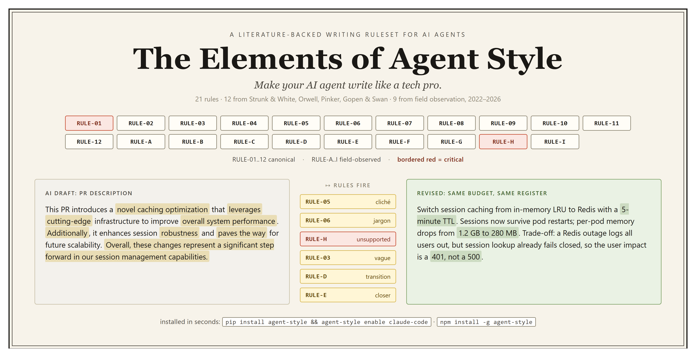

<!-- SPDX-License-Identifier: CC-BY-4.0 -->

<a id="readme-top"></a>

<div align="center">

# The Elements of Agent Style

**Make your AI agent write like a tech pro.**

*21 rules: 12 from classic writing guides, 9 from field observation of LLM output, 2022-2026.*

[](https://pypi.org/project/agent-style/)
[](https://www.npmjs.com/package/agent-style)
[](NOTICE.md)
[](https://github.com/yzhao062/agent-style/actions/workflows/validate.yml)
[](https://github.com/yzhao062/agent-style)

[Before / after](#before-and-after) &nbsp;·&nbsp;
[What it is](#what-it-is) &nbsp;·&nbsp;
[Use](#use)

</div>

## Before and After



The top row is the identity: 21 rules, 12 canonical plus 9 field-observed; bordered red marks the two critical rules (RULE-01 curse-of-knowledge and RULE-H citation discipline). The bottom row is the mechanism: a typical AI-drafted PR description on the left (highlighted phrases are rule violations), the specific rules that fire in the middle, and the revised version on the right, with the same budget, same register, still a PR description rather than a technical report.

## What It Is

A curated set of English writing rules formatted for AI coding and writing agents to follow **at generation time**, not as a post-hoc linter.

### Scope

| In scope | Out of scope |
| --- | --- |
| API docs, design docs, research papers, grant proposals | Fiction, poetry, marketing copy |
| READMEs, runbooks, commit messages, error messages | Long-form narrative non-fiction |
| Technical blog posts, postmortems, issue reports | Non-English prose; any context where rhythm or affect matter more than precision |

### Two Rule Groups, Peer Inputs

The 21 rules split by origin. The agent reads both as equal peers; no group is annotated as higher-priority than the other.

- **`RULE-01..12` (canonical).** Distilled from Strunk & White, Orwell, Pinker, and Gopen & Swan. Each rule cites its source by chapter, section, or essay rule; I verified every citation against the original works. Full names in the table below.
- **`RULE-A..I` (field-observed).** Patterns I logged from AI output across dozens of writing projects (papers, grant proposals, technical documentation, agent configs) and code releases, 2022 to 2026. Transparent attribution: these are not literature-backed but capture LLM-specific failure modes that the canonical set alone misses (RULE-H citation discipline is the critical one). Full names in the table below.

Named in homage to Strunk & White's *The Elements of Style* (1918/1959), one of the four canonical sources.

### Canonical Rules (RULE-01 through RULE-12)


Sourced from writing authorities; each rule cites its source by chapter, section, or essay rule.

| # | Rule | Primary source |
| --- | --- | --- |
| 01 | Do not assume the reader shares your tacit knowledge | Pinker 2014, Ch. 3 |
| 02 | Do not use passive voice when the agent matters | Orwell 1946 Rule 3; S&W §II.14 |
| 03 | Do not use abstract or general language when a concrete, specific term exists | S&W §II.16; Pinker 2014 Ch. 3 |
| 04 | Do not include needless words | S&W §II.17; Orwell 1946 Rule 3 |
| 05 | Do not use dying metaphors or prefabricated phrases | Orwell 1946 Rule 1 |
| 06 | Do not use avoidable jargon where an everyday English word exists | Orwell 1946 Rule 5; Pinker 2014 Ch. 2 |
| 07 | Use affirmative form for affirmative claims | S&W §II.15 |
| 08 | Do not linguistically overstate or understate claims relative to the evidence | Pinker 2014 Ch. 6; Gopen & Swan 1990 |
| 09 | Express coordinate ideas in similar form (parallel structure) | S&W §II.19 |
| 10 | Keep related words together | S&W §II.20; Gopen & Swan 1990 |
| 11 | Place new or important information in the stress position at the end of the sentence | Gopen & Swan 1990 |
| 12 | Break long sentences; vary length (split sentences over 30 words) | S&W §II.18; Pinker 2014 Ch. 4 |

### Field-Observed Rules (RULE-A through RULE-I)

Structural patterns logged from LLM output across research, proposal, documentation, and agent-configuration work, 2022 to 2026. Treated as peer input to the canonical rules when an agent consumes the ruleset.

| # | Rule |
| --- | --- |
| A | Do not convert prose into bullet points unless the content is a genuine list (and do not over-bullet where 2 items or a sentence fit) |
| B | Do not use em or en dashes as casual sentence punctuation |
| C | Do not start consecutive sentences with the same word or phrase |
| D | Do not overuse transition words ("Additionally", "Furthermore", "Moreover") |
| E | Do not close every paragraph with a summary sentence |
| F | Use consistent terms; do not redefine abbreviations mid-document |
| G | Use title case for section and subsection headings (articles, short prepositions, and coordinating conjunctions stay lowercase) |
| H | **Support factual claims with citation or concrete evidence; do not be handwavy (critical)** |
| I | Prefer full forms over contractions in formal technical prose ("it is" over "it's") |

**Escape hatch** (Orwell 1946 Rule 6): *"Break any of these rules sooner than say anything outright barbarous."* Rules are guides to clarity, not ends in themselves.

See [`RULES.md`](RULES.md) for the full per-rule blocks with BAD/GOOD examples, enforcement tier, and rationale.

## Who It Is For

- **AI coding and writing agents:** Claude Code, Codex, GitHub Copilot, Cursor, Aider, Anthropic Skills, Replit Agent, Windsurf, Amazon Q Developer, JetBrains AI Assistant, Ollama, Continue.dev, Tabnine, OpenCode, OpenAI Agents SDK skills, and any `AGENTS.md`-compliant tool. Each agent reads the ruleset as part of its system prompt or project config.
- **Maintainers of those agents' configurations** who want generated prose to follow literature-backed writing conventions rather than reproduce common LLM tell-patterns.

## Use

Two install paths: a CLI (recommended) or a manual `curl` recipe for users who prefer not to install a package. Both paths respect a strict no-overwrite contract: your existing instruction files are never overwritten.

### Install via CLI

```bash
pip install agent-style                              # Python users
# or: npm install -g agent-style                     # Node users
# or: npx --yes agent-style@0.1.1 <subcommand>       # no install needed

agent-style list-tools                               # show supported tools
agent-style enable claude-code                       # wire up Claude Code
agent-style enable agents-md                         # wire up AGENTS.md (Codex, Jules, Zed, Warp, Gemini CLI, VS Code, and others)
agent-style enable claude-code --dry-run             # preview changes without writing
agent-style enable claude-code --dry-run --json      # machine-readable plan
agent-style disable claude-code                      # reverse enable
agent-style rules                                    # print bundled RULES.md to stdout
```

<details>
<summary><b>What <code>enable</code> Does per Tool (All Safe, All Idempotent)</b></summary>
<br>

- **Claude Code (`import-marker`)**: writes `.agent-style/RULES.md` and `.agent-style/claude-code.md`; safe-appends `@.agent-style/claude-code.md` in a marker block to your existing `CLAUDE.md`. Creates `CLAUDE.md` only if absent.
- **AGENTS.md, Copilot repo-wide (`append-block`)**: safe-appends a marker-wrapped compact adapter block to your existing instruction file. Content above and below the marker is preserved.
- **Cursor, Copilot path-scoped, Anthropic Skills (`owned-file`)**: writes a new agent-style-owned file at the tool's rule-directory path (`.cursor/rules/agent-style.mdc`, `.github/instructions/agent-style.instructions.md`, `.claude/skills/agent-style/SKILL.md`). Fails closed if a non-agent-style file is already there.
- **Codex API (`print-only`)**: writes `.agent-style/codex-system-prompt.md`; prints the prompt body to stdout, manual-step instructions to stderr. You paste the prompt into your Codex API `system_prompt`.
- **Aider (`multi-file-required`)**: writes `.agent-style/aider-conventions.md`; prints a `.aider.conf.yml` snippet to stderr. You paste both files into the config.

For `print-only` and `multi-file-required`, the JSON output carries `manual_step_required: true` and `enabled: false`; exit code stays 0 (the CLI did everything it can do) and the first line of human output is exactly `manual step required:` followed by the specific action.

</details>

### Install via Manual `curl`

For users who prefer not to install a package. Pins to a specific release so adapters and `RULES.md` stay consistent:

```bash
AGENT_STYLE_REF=v0.1.1
mkdir -p .agent-style
curl -fsSLo .agent-style/RULES.md       "https://raw.githubusercontent.com/yzhao062/agent-style/${AGENT_STYLE_REF}/RULES.md"
curl -fsSLo .agent-style/claude-code.md "https://raw.githubusercontent.com/yzhao062/agent-style/${AGENT_STYLE_REF}/agents/claude-code.md"
```

Then add ONE line to your `CLAUDE.md` (create the file only if absent; never overwrite):

```text
@.agent-style/claude-code.md
```

For other surfaces, substitute the adapter filename and follow the per-surface table below. The `curl` commands only write under `.agent-style/`; the one-line import into your instruction file is the only edit you make to files you own.

### Per-Surface Paths (v0.1.1 primary set)

<details>
<summary><b>Eight primary adapters (full matrix in <code>adapter-matrix.md</code>)</b></summary>

| Tool | install_mode | Target path |
| --- | --- | --- |
| Claude Code | `import-marker` | `CLAUDE.md` (marker block with `@.agent-style/claude-code.md`) |
| AGENTS.md (Codex, Jules, Zed, Warp, Gemini CLI, VS Code, and others) | `append-block` | `AGENTS.md` at repo root |
| GitHub Copilot (repo-wide) | `append-block` | `.github/copilot-instructions.md` |
| GitHub Copilot (path-scoped) | `owned-file` | `.github/instructions/agent-style.instructions.md` |
| Cursor | `owned-file` | `.cursor/rules/agent-style.mdc` |
| Anthropic Skills | `owned-file` | `.claude/skills/agent-style/SKILL.md` |
| Codex (API / manual paste) | `print-only` | `.agent-style/codex-system-prompt.md` (user pastes into API system prompt) |
| Aider | `multi-file-required` | `.agent-style/aider-conventions.md` + `.aider.conf.yml` snippet |

</details>

Adapters for Amazon Q Developer, JetBrains AI Assistant, Windsurf, Ollama, Replit, OpenCode, Continue.dev, Tabnine, OpenAI Agents SDK skills, and Copilot path-scoped variants beyond the above are planned for v1.1; see the "Planned adapters" section of [`adapter-matrix.md`](adapter-matrix.md).

### Self-Verification

After running `agent-style enable <tool>` (or completing the manual setup), ask your agent:

> Is agent-style active?

Expected reply:

> agent-style v0.1.1 active: 21 rules (RULE-01..12 canonical + RULE-A..I field-observed); full bodies at .agent-style/RULES.md.

If the version string or rule count is missing, the file is on disk but not in your agent's active context. Check that your tool's instruction-file reload behavior picked up the new content (some tools require a session restart).

### Uninstall

Two-step recipe; `agent-style clean` ships as one command in v0.2.0:

```bash
# Step 1: remove the marker block from each instruction file you enabled
agent-style disable claude-code
agent-style disable cursor
# ...repeat for each enabled tool; agent-style list-tools shows the set

# Step 2: remove the shared .agent-style/ data
rm -rf .agent-style/                              # POSIX
Remove-Item -Recurse -Force .agent-style          # PowerShell
```

Skipping step 1 leaves orphan marker blocks in your instruction files; skipping step 2 leaves shared rule data on disk.

<details>
<summary><b>Complementary Post-Hoc Linting</b></summary>
<br>

This repo is read at generation time. For a linter that runs over committed prose in CI, see [ProseLint](https://github.com/amperser/proselint); per-rule check-ID mappings are in [`enforcement/proselint-map.md`](enforcement/proselint-map.md). Vale users can plug ProseLint via its existing style-pack ecosystem.

</details>

### v0.2.0 Roadmap

Planned CLI additions: `agent-style update` (refresh installed adapters to latest), `agent-style override <RULE-ID> disable` (per-rule opt-out), `agent-style clean` (one-command uninstall), `.agent-style/config.toml` (project-level config), and filled adapters for the planned-adapter set above. Track progress in [`CHANGELOG.md`](CHANGELOG.md).

<details>
<summary><b>Curation and method</b></summary>
<br>

The 12 canonical rules are not a generated digest of the four source works. I read each source, extracted the rules most applicable to English technical prose, filtered for AI-agent failure modes I had seen in practice, and phrased each rule using the negative-versus-positive split that Zhang et al. 2026 found empirically effective for coding-agent instructions. Rules that are supported by a source but that do not map to a concrete AI-R&D failure mode are excluded. The intersection is what this repo ships as the canonical set.

The 9 field-observed rules (`RULE-A` through `RULE-I`) come from my own observation of AI output across dozens of writing projects and code releases, 2022 to 2026. Each pattern appeared often enough across distinct projects to warrant a named rule. These rules are labeled transparently as field observations in `RULES.md` and sit next to the canonical rules in all adapter files.

New contributions are welcome. A canonical-track rule must cite a source from the writing-authority bucket or the agent-instruction-evidence bucket below, include BAD/GOOD examples drawn from real technical-prose output, and include a rationale for why the rule matters specifically for AI-agent-generated prose. I curate field-observed rule additions to keep the list tight.

</details>

<details>
<summary><b>Canonical sources</b></summary>
<br>

Four writing authorities for prose content, plus two recent empirical papers for rule format and phrasing. Every one of the 12 canonical rules cites its source explicitly; **I verified every citation against the original work, not scraped or summarized from search results.** When the final text disagrees with an authority, the disagreement is stated in the rule's rationale.

#### Writing Authorities (Prose Content)

1. **Strunk, W., Jr., & White, E. B. (1959).** *The Elements of Style* (revised from Strunk 1918). The Macmillan Company. Especially Part II, "Elementary Principles of Composition" (§§12-22).
2. **Orwell, G. (1946).** "Politics and the English Language." *Horizon*, April 1946. Public domain; freely available online.
3. **Pinker, S. (2014).** *The Sense of Style: The Thinking Person's Guide to Writing in the 21st Century*. Viking. Especially Ch. 2 (classic style), Ch. 3 (curse of knowledge), Ch. 6 (calibrated claims).
4. **Gopen, G. D., & Swan, J. A. (1990).** "The Science of Scientific Writing." *American Scientist*, 78(6), pp. 550-558.

#### Agent-Instruction Evidence (Rule Format and Phrasing)

5. **Zhang, X. et al. (2026).** "Do Agent Rules Shape or Distort? Guardrails Beat Guidance in Coding Agents." arXiv:2604.11088. 25,532 rules across 679 instruction files; motivates negative-constraint phrasing for anti-pattern rules.
6. **Bohr, J. (2025).** "Show and Tell: Prompt Strategies for Style Control in Multi-Turn LLM Code Generation." arXiv:2511.13972. Motivates the directive + BAD/GOOD example format used throughout `RULES.md`.

See [`SOURCES.md`](SOURCES.md) for the full bibliography and recommended reading ranges per source.

</details>

## License

Dual license with file-level SPDX boundaries:

| Content | License |
| --- | --- |
| `RULES.md`, `SOURCES.md`, `NOTICE.md`, `agents/`, `adapter-matrix.md` | [CC BY 4.0](LICENSES/CC-BY-4.0.txt) |
| `enforcement/`, `.github/workflows/`, generator scripts | [MIT](LICENSES/MIT.txt) |

Every source file carries an SPDX-License-Identifier header. See [`NOTICE.md`](NOTICE.md) for the attribution snippet consumers should retain on reuse.

## Maintenance

Maintained by [Yue Zhao](https://yzhao062.github.io), USC CS faculty and author of [PyOD](https://github.com/yzhao062/pyod). Issues and pull requests welcome; contributions that add a canonical rule must cite a source from the buckets above. See [`CHANGELOG.md`](CHANGELOG.md) for release history and upcoming work.

<div align="center">

<a href="#readme-top">↑ back to top</a>

</div>
